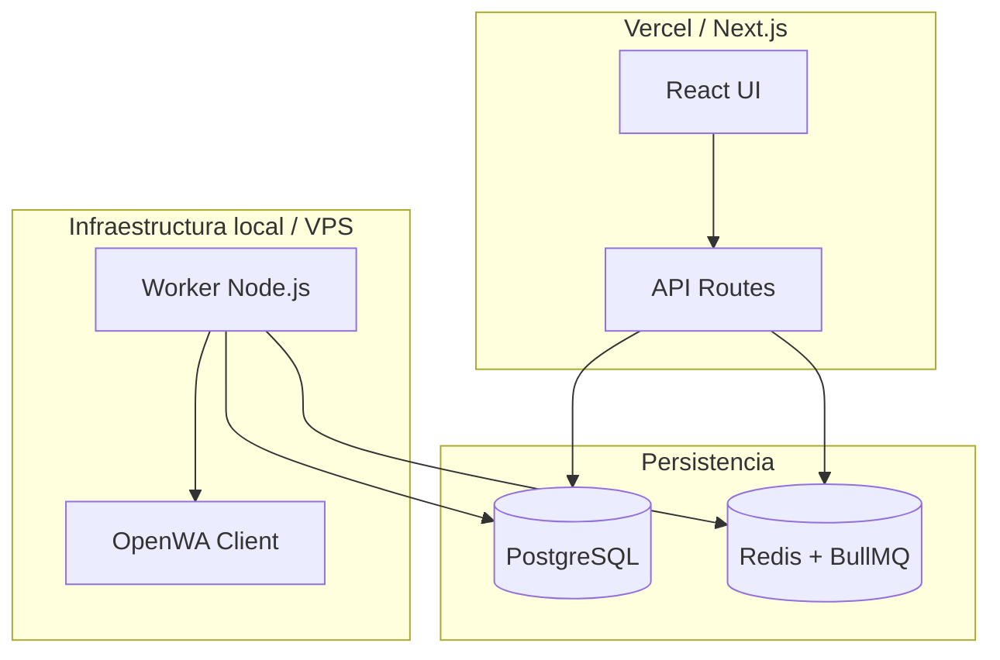

# Gestor de Campañas WhatsApp

Plataforma de cobranzas **marca blanca** para programar y enviar notificaciones vía WhatsApp con OpenWA, rate limiting estricto y arquitectura hexagonal.

## Arquitectura



### Flujo de datos

1. **UI** → El usuario ingresa números, mensaje y fecha/hora.
2. **API (Next.js)** → Valida, persiste campaña + mensajes en PostgreSQL y encola jobs en BullMQ con `delay` hasta la hora programada.
3. **Worker (proceso separado)** → Consume la cola Redis, aplica rate limit **10 msgs / 5 min** y envía vía OpenWA.
4. **PostgreSQL** → Fuente de verdad para estados (`pending → queued → processing → sent/failed`).

### Capas (Hexagonal)

| Capa | Ubicación | Responsabilidad |
|------|-----------|-----------------|
| Dominio | `src/domain/` | Entidades, interfaces, reglas puras |
| Aplicación | `src/application/` | Casos de uso, validadores |
| Infraestructura | `src/infrastructure/` | Drizzle, BullMQ, OpenWA |
| Presentación | `src/presentation/`, `src/app/` | React + API Routes |
| Worker | `src/worker/` | Procesador de cola (no serverless) |

### ¿Por qué Drizzle?

- Tipado estricto sin motor binario (ideal para Vercel/serverless).
- Bundle liviano vs Prisma Client.
- SQL explícito cuando se necesita optimizar.

### ¿Por qué BullMQ + Redis?

- Jobs persistentes (no `setTimeout` en memoria).
- Rate limiter nativo: `max: 10, duration: 300000`.
- Reintentos con backoff exponencial.

## Requisitos

- Node.js 20+
- Docker (PostgreSQL + Redis)
- [OpenWA Gateway](https://github.com/rmyndharis/OpenWA) (recomendado) o `@open-wa/wa-automate` embebido
- Cuenta WhatsApp para escanear QR

> **OpenWA Gateway:** servicio REST separado con dashboard incluido. Ver [`docs/OPENWA.md`](./docs/OPENWA.md).

## Inicio rápido con Docker (todo junto)

**Windows — instalación automática (recomendada):**

```bat
scripts\setup.bat
```

O vía npm:

```bash
npm run docker:setup
```

El script:
1. Crea `.env` si no existe
2. Levanta todos los contenedores
3. Espera a que OpenWA esté listo
4. **Lee la API key de los logs y la guarda en `.env`**
5. Reinicia el worker con la clave correcta

**Manual:**

```bash
# 1. Variables (clave API compartida OpenWA ↔ worker)
cp .env.docker.example .env

# 2. Construir y levantar todo
npm run docker:up

# 3. Sincronizar API key automáticamente
npm run docker:sync-key
docker compose up -d worker
```

| Servicio | URL |
|----------|-----|
| **Gestor (tu app)** | http://localhost:3000 |
| **OpenWA Dashboard** (escanear QR) | http://localhost:2886 |
| **OpenWA API** | http://localhost:2785/api |
| **OpenWA Swagger** | http://localhost:2785/api/docs |
| **OpenWA Health** | http://localhost:2785/api/health |
| PostgreSQL | localhost:3069 |
| Redis | localhost:6379 |

> **Token (API key):** `npm run docker:sync-key` o `type .env | findstr OPENWA_API_KEY`. Detalle en [`docs/DOCKER.md`](./docs/DOCKER.md#cómo-ver-el-token-api-key-de-openwa) y [`docs/OPENWA.md`](./docs/OPENWA.md#cómo-ver-el-token-api-key).

> La **primera build** tarda varios minutos (clona OpenWA + instala Chromium).

Guía detallada: [`docs/DOCKER.md`](./docs/DOCKER.md) (servicios, variables, troubleshooting, archivos).

### Primer uso de WhatsApp

1. Abrí http://localhost:2886 y verificá que OpenWA esté activo.
2. Creá/iniciá la sesión `gestor-campanas` (o la que definiste en `OPENWA_SESSION_ID`).
3. Escaneá el código QR con WhatsApp.
4. Programá un envío desde http://localhost:3000.

### Solo infraestructura (desarrollo local sin Docker para la app)

```bash
npm run docker:infra   # solo Postgres + Redis
npm run dev            # Next.js local
npm run worker         # Worker local
```

---

## Inicio rápido (desarrollo local sin Docker para la app)

```bash
# 1. Dependencias (OpenWA embebido requiere omitir postinstall en Windows)
npm install --ignore-scripts

# 2. Variables de entorno
cp .env.example .env

# 3. Infraestructura local
npm run docker:infra

# 4. Migraciones
npm run db:push

# 5. Seed organización por defecto
npm run db:seed

# 6. OpenWA Gateway (terminal 1) — ver docs/OPENWA.md
git clone https://github.com/rmyndharis/OpenWA.git ../OpenWA
cd ../OpenWA && npm install && npm run dev

# 7. Next.js (terminal 2)
cd ../gestor_de_campañas && npm run dev

# 8. Worker de cola (terminal 3)
npm run worker
```

## Producción

| Componente | Destino |
|------------|---------|
| Next.js UI + API | Vercel |
| PostgreSQL | [Neon](https://neon.tech) — usar `DATABASE_URL` con SSL |
| Redis | Upstash Redis (compatible con BullMQ) |
| Worker + OpenWA | VPS, Railway, o contenedor Docker dedicado |

> OpenWA **no** debe ejecutarse en Vercel (binarios pesados, timeouts, sesión persistente).

## Rate limiting

Configurado en el worker BullMQ:

```typescript
limiter: {
  max: 10,           // RATE_LIMIT_MAX
  duration: 300_000,   // RATE_LIMIT_DURATION_MS (5 min)
}
```

Además, `concurrency: 1` evita envíos paralelos que evadan el límite.

## Marca blanca

La tabla `organizations` centraliza:

- Nombre, logo, colores
- Plantillas de mensaje (`messageTemplates`)
- Texto de footer

Cada despliegue puede apuntar a un `DEFAULT_ORG_SLUG` distinto o extender la API para multi-tenant.

## Scripts

| Comando | Descripción |
|---------|-------------|
| `npm run dev` | Servidor Next.js (local) |
| `npm run worker` | Worker OpenWA + cola (local) |
| `npm run docker:setup` | Instalación completa + sync API key (Windows) |
| `npm run docker:up` | Construye y levanta **todo** (app + worker + OpenWA + DB) |
| `npm run docker:sync-key` | Lee API key de OpenWA y actualiza `.env` |
| `npm run docker:backup` | Exporta volúmenes + `.env` para migrar a otra PC |
| `npm run docker:restore` | Restaura backup e instala |
| `npm run docker:down` | Detiene todos los contenedores |
| `npm run docker:logs` | Logs en tiempo real |
| `npm run docker:infra` | Solo Postgres + Redis |
| `npm run db:push` | Sincroniza esquema Drizzle |
| `npm run db:seed` | Crea organización por defecto |
